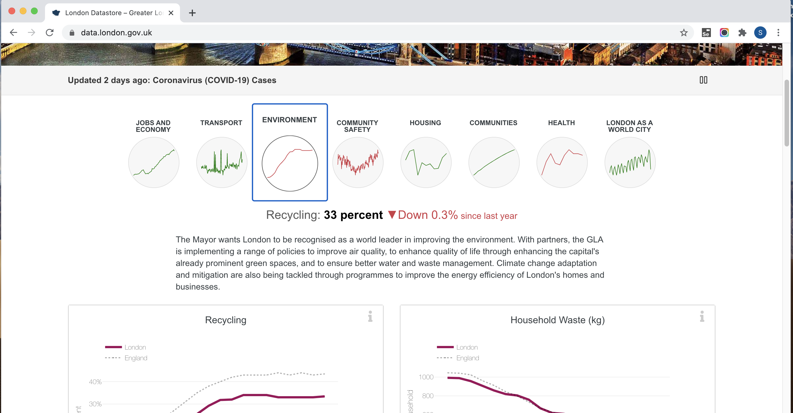
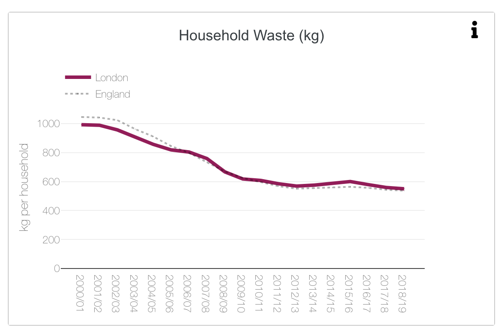
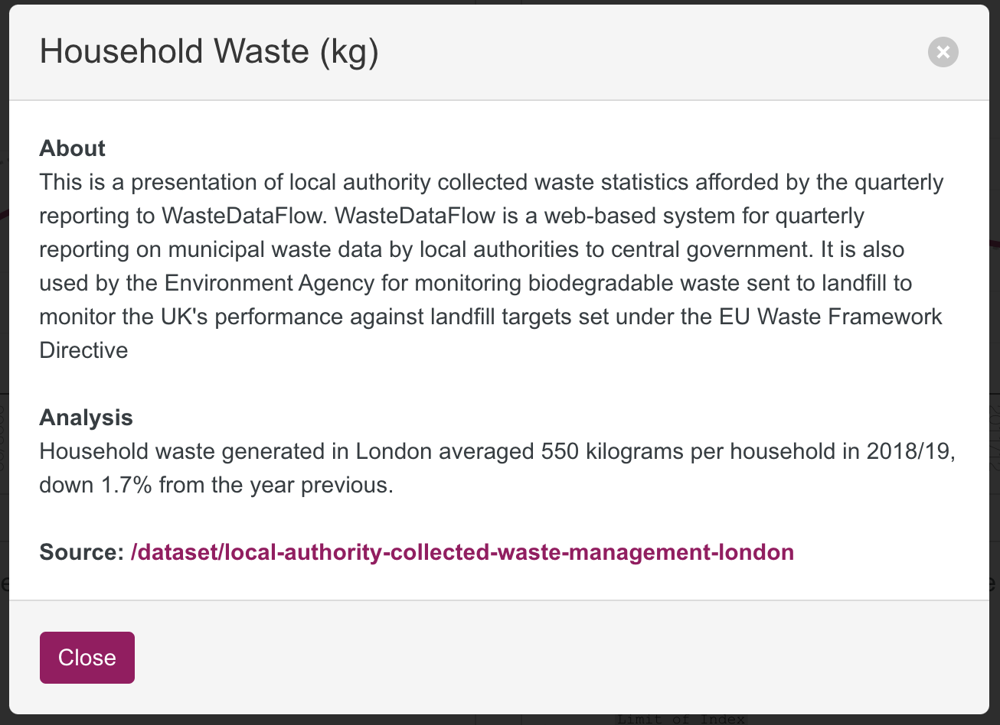

# Create an environmental dashboard for London using Dash

The task is to create an environment dashboard for London using data from the London Datastore.

Go to the London Datastore and select the environment logo to recreate one or two of the charts.



The first chart shown on the website was re-created in exercise 3 in this repository and the data is already downloaded
in the data directory. To find the data for the other charts, click on the **i** symbol in the top right of the charts 
shown on the London Datastore website. 


This will give you details of the chart including a hyperlink to the source data.



A guide, the likely steps to create your dashboard:

1. Create a new project in your IDE
2. Create a venv
3. Install required packages in the venv e.g. Dash, pandas, plotly
4. Download the data and save in a 'data' directory
5. Find css to use (e.g. add a css file to the `assets` directory, or use a CDN hosted version, or use the dash-bootstrap-components
   library)
6. Create an app.py in which you:

    - Import the required libraries
    - Import the dataset
    - Create the figure(s) e.g. using Plotly Express
    - Create the app instance
    - Create the app.layout
    - Run the server

Note: You might want to create an initial app.py with no CSS, data or figures and simply an html p element with 'Hello,
World' in the layout. This would allow you to test your app runs with minimal coding.

If you develop your app incrementally it may help you to pinpoint errors. For example, next add CSS and stop and restart
the app. Then add data and figure and the restart the app again.

...and so on...

## Create a new project

It is likely to be easier if you create a new project in your IDE for this activity to avoid any conflict with the
existing `app.py`.

This will also give you practice in structuring a Dash project from scatch.

A typical structure may be:

```
dash_app_name/
  /assets/  # An optional directory that contains CSS stylesheets, images, or custom JavaScript files. Dash will automatically serve all of the files that are included in this folder.
      app.css  
  /data/  # An optional directory that contains the data files (unless this is accessed via an API or database server).
      data.csv
  app.py  # Contains your Dash app code and code to run the server. Sometimes named dash.py or dashboard.py.
  .gitignore  # The files and folders to be ignored in git.
  requirements.txt  # The app's python dependencies.
  /venv/   # The python virtual environment
```

